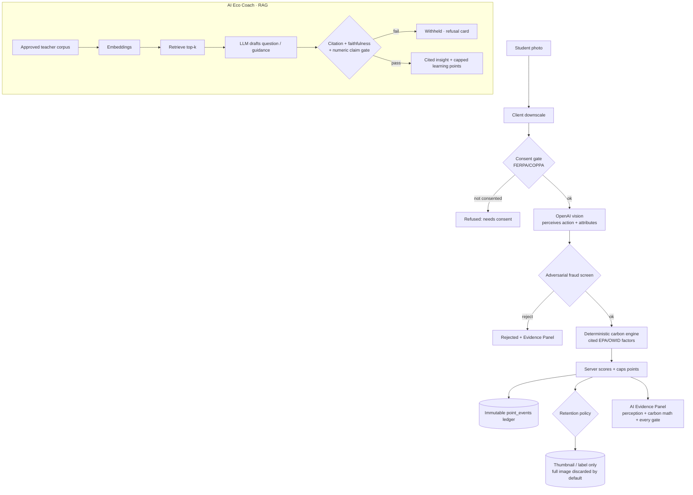

# EcoRise — AI-Powered Environmental Learning + Action

EcoRise is a school and community platform where students learn environmental science, log real-world eco actions, and compete on leaderboards without letting AI invent impact or award unverified points.

**USAII Global AI Hackathon 2026 Direction B:** EcoRise is framed as "My School's Hidden Footprint." The AI Eco Coach is the main learning surface; the new **School Footprint Insights** dashboard is the core Direction B showcase — it ingests five institutional datasets, detects anomalies, forecasts cafeteria waste with an OLS regression model, ranks impact-ranked recommendations, and generates a plain-language weekly digest via OpenAI — all with a human approval gate before any recommendation becomes active.

**The pitch:** Duolingo-style environmental learning meets verified action tracking. The AI teaches and explains; deterministic code validates sources, carbon math, fraud checks, and points.


---

## Direction B: School Footprint in 5 Steps

This is the submission centerpiece. A judge who sees only this section will understand what makes EcoRise different.

1. **Open Home** → tap "School Hidden Footprint" card → dashboard loads with 59 days of institutional data (energy, water, trash, transportation, cafeteria) already ingested.
2. **Section ① Anomaly detection** — rolling 14-day z-score flags any building reading > 1.5σ above normal. Example card: _"Main Building used 111% more electricity than normal on 2026-04-14 (2.1σ above normal)."_ No LLM. Fully auditable.
3. **Section ② Cafeteria forecast** — OLS regression (implemented from scratch, normal equations via Gaussian elimination) predicts next week's food waste with a confidence band. Example: _"Friday: 57.2 lbs predicted · Range: 48–66 lbs · ⓘ ±16%, based on 59 days · OLS model."_ A range, not a false-precision single number.
4. **Section ③ Ranked recommendations** — up to 4 candidate actions sorted by estimated impact (CO₂e, lbs waste, kWh). Each has a one-sentence reason derived from the data so the approver can sanity-check it. Click **"✓ Approve — Make Active Goal"** → status moves from `proposed` to `approved` and becomes visible school-wide. **The AI cannot do this itself.**
5. **Section ④ Generative AI weekly digest** — OpenAI produces one plain-language paragraph for eco-club students, clearly labelled "Generative AI — Weekly Digest" and visually separated from the deterministic cards. Falls back to a deterministic template with no API key.

> **The line that matters:** _The AI never awards a point or invents a kilogram. It perceives and drafts; a deterministic, cited engine decides._

---

## School Footprint Insights — AI Architecture (copy to Devpost)

### Inputs / AI Capability / Processing / Outputs

| Layer | Detail |
|-------|--------|
| **Inputs** | 5 synthetic school datasets (energy kWh/day per building, water gallons/day, trash/recycling lbs/day, transportation mode splits, cafeteria food waste lbs/day). 59 school days of data ingested from CSV into SQLite on server startup. |
| **AI Capability 1 — Anomaly Detection** | Deterministic rolling-14-day z-score per building per metric. Flags any day where usage exceeded mean + 1.5 standard deviations. No LLM involved — pure statistical detection, fully auditable. Surfaced as "Unusual activity detected" cards with building, date, % above normal, and σ deviation. |
| **AI Capability 2 — Predictive Modeling** | OLS linear regression (normal equations via Gaussian elimination, implemented from scratch in `utils/footprintInsights.js`). Features: intercept + 4 day-of-week dummies (Monday = reference category) + binary `post_holiday` flag. Trained on all available cafeteria records. Outputs: predicted food waste lbs per day for the next school week, plus a ±confidence band (RMSE-derived). Every prediction card shows its assumptions inline: training data size, RMSE, feature set. |
| **AI Capability 3 — Recommendation Engine** | Ranks up to 4 candidate actions by estimated impact (food waste reduction lbs, energy excess kWh, CO₂e avoided, water saved). Each recommendation includes a single-sentence reasoning string derived from the underlying data. Top 3 are stored per week in `fp_recommendations` with status = `proposed`. |
| **AI Capability 4 — Generative AI (plain-language summary)** | Uses the existing OpenAI client (`utils/aiClient.js` → `generateFootprintSummary()`) to produce one plain-language paragraph for eco-club students from the structured anomaly + prediction + recommendation data. Cached per week. Falls back to a deterministic template when no API key is set. Visually separated from the deterministic AI cards so judges can see all four AI capability categories distinctly. |
| **Processing** | `backend/utils/footprintInsights.js` — anomaly detection + OLS regression + recommendation ranking. `backend/routes/footprint.js` — REST API. `backend/utils/aiClient.js` — generative summary. All deterministic math is server-side; LLM is used only for the final plain-language narrative layer. |
| **Outputs** | Anomaly cards (building, date, σ, % above), prediction cards (lbs ± confidence per day), ranked recommendation list (proposed → approved two-step), AI plain-language weekly summary paragraph. |

---

## Responsible AI — Risk & Mitigation (copy to Devpost)

| Risk | Mitigation |
|------|-----------|
| **Inaccurate predictions cause operational decisions** (e.g., cafeteria under-orders food, students go hungry) | Every AI-generated number shows its assumptions inline via `ⓘ` tags (training data size, RMSE, confidence %). A human must approve before any recommendation becomes operational. |
| **Anomaly detection false positives disrupt school operations** | Threshold is 1.5σ, not a hard alert — labelled "Unusual activity detected" not "Emergency." Only surfaced for human review, never auto-acted. |
| **LLM summary hallucinates numbers** | `generateFootprintSummary` is explicitly told "Do NOT invent numbers not in the data" and receives only the structured insight objects, not raw records. A "Flag as inaccurate" button on every AI card logs flags to `fp_insight_feedback` for model improvement. |
| **Lack of data diversity (synthetic data)** | Prominently labelled as synthetic/demo data. The seed script and CSV files are open-source; a school can replace them with real readings via the same schema. |

---

## Human-in-the-Loop Design (copy to Devpost)

**Decision the AI does NOT make:** approving a recommendation for public display or operational action (e.g., ordering less food, adjusting cafeteria prep quantities, emailing parents about transportation, auto-scheduling HVAC changes).

**A human must remain in control here because:** the AI's cafeteria waste predictions carry ±15% uncertainty derived from the model's RMSE on 59 days of training data. Acting automatically on a prediction that is within the normal confidence band could cause the cafeteria to under-order food, leaving students with inadequate meals, or over-alert facilities staff with false-positive energy anomalies, eroding trust in the system. A named role — the **Sustainability Coordinator** or **Cafeteria Manager** — must explicitly click "Approve — Make Active Goal" before a recommendation moves from `proposed` to `approved` status and becomes visible as the school-wide goal on the leaderboard feed. This two-step gate is implemented as a real state machine in `fp_recommendations.status` (`proposed → approved`), not a checkbox or a comment.

**Code comment (backend/routes/footprint.js line 1–17):**
```
Decision the AI does NOT make: approving a recommendation for public display
or operational action. The AI proposes; a named human role —
sustainability_coordinator or cafeteria_manager — must click "Approve" to
move the recommendation from "proposed" to "approved". Only approved
recommendations are shown on the school-wide public leaderboard feed as
a school-wide goal. A human must remain in control here because: the AI's
predictions carry ±15% uncertainty and could cause real operational problems
(under-ordering food leading to hungry students, over-alerting staff) if acted
upon automatically without review.
```

---

## Why Judges Should Care

Most sustainability apps either teach passively or gamify actions without proof. EcoRise connects the full loop:

1. A student learns from a cited, teacher-approved source.
2. The AI Eco Coach studies the school's local action pattern and identifies the weakest footprint category.
3. The coach asks a grounded question, explains the answer, and recommends a practical next action.
4. Small learning points are capped so questions cannot be farmed.
5. A photo submission is checked by AI vision, anti-fraud gates, carbon math, and server-side scoring.
6. The leaderboard rewards verified environmental behavior, not vibes.

That makes the product easy to demo and technically defensible: every important claim has a source, a deterministic check, or an eval.

> **Sticky hook:** _The AI never awards a point or invents a kilogram. It perceives; a deterministic, cited engine decides._

## What's new in v2 (Direction B)

- **School Hidden-Footprint digest** — estimates a school's institutional CO₂e by category from cited EPA/OWID factors, each with a confidence band, and points students at the biggest hidden emitter.
- **Privacy / FERPA-COPPA engine** — consent gate before any minor's photo is processed, image-retention minimization, teacher review, account export/delete, audit log. See [`docs/PRIVACY.md`](docs/PRIVACY.md).
- **In-app AI report card** — real eval-harness output (citation validity, faithfulness, refusal precision, hallucination, injection resistance, retrieval Recall@k/MRR), not hardcoded.
- **Scale honesty** — measured load test + **sqlite-vec KNN index now active** (see [`docs/SCALE.md`](docs/SCALE.md) for the documented migration path to pgvector).
- **Run the demo:** [`DEMO_SCRIPT.md`](DEMO_SCRIPT.md) · **Deploy + record:** [`DEPLOY.md`](DEPLOY.md)

## Architecture — the perception / calculation split



The LLM only appears in the _perceive_ and _draft_ boxes. Every box that touches a number, a point, or a published post is deterministic code with a citation or a gate.

## How EcoRise compares

|               | Typical eco app           | Generic "AI" hackathon app | **EcoRise**                                                                              |
| ------------- | ------------------------- | -------------------------- | ---------------------------------------------------------------------------------------- |
| Impact number | self-reported / hardcoded | LLM guesses it             | deterministic carbon engine, cited EPA/OWID factors + uncertainty band                   |
| Points        | client-trusted            | LLM awards them            | server-computed, capped, immutable ledger; LLM cannot mint                               |
| AI grounding  | none                      | ungrounded generation      | retrieval + citation + faithfulness + numeric-claim gates; refuses if unsupported        |
| Minor privacy | ignored                   | ignored                    | consent gate before upload, image minimization, teacher review, export/delete, audit log |
| Evaluation    | "it works"                | demo only                  | measured: accuracy/FP/FN, Recall@k/MRR, refusal precision, hallucination rate (in-app)   |
| Scale story   | hand-waved                | hand-waved                 | measured load test + documented migration path                                           |

## Core Features

| Feature                       | Description                                                                                                                                                                                                                                                                                                |
| ----------------------------- | ---------------------------------------------------------------------------------------------------------------------------------------------------------------------------------------------------------------------------------------------------------------------------------------------------------- |
| **School Footprint Insights** | Direction B centerpiece. Ingests 5 institutional datasets, detects anomalies (rolling z-score), forecasts cafeteria waste (OLS regression, from scratch), ranks impact-weighted recommendations, generates a plain-language digest via OpenAI. Human approval gate before any recommendation goes live. |
| **AI Eco Coach**              | Retrieval-augmented coach over an approved teacher corpus. Generates cited questions, explains answers, identifies the school's weakest footprint category, recommends next actions. Citation + faithfulness + numeric-claim gates; withholds rather than hallucinating. |
| **AI Evidence Panel**         | After **every** submission: which model decided, its confidence, the **grounded** CO₂ math (formula + cited source + uncertainty range), the full point breakdown, the deterministic tool pipeline that ran, and every anti-fraud gate cleared (or why it was rejected). |
| **AI Action Analysis**        | Upload a photo → OpenAI vision **perceives** the action + measurable attributes; it never invents the impact.                                                                                                                                                                                               |
| **Grounded Carbon Engine**    | Deterministic kg CO₂e from **published emission factors** (EPA GHG Hub, EPA WARM, OWID/Poore-Nemecek) with formula + uncertainty range — the LLM cannot fabricate the number ([`utils/carbonEngine.js`](backend/utils/carbonEngine.js))                                                                    |
| **Measured Eval Gate**        | Eco-action classifier is measured, not asserted: accuracy / FP / FN / adversarial-rejection / calibration ([`test/eco_eval/`](backend/test/eco_eval/), `npm run test:eval`); coach retrieval eval at `npm run test:coach-eval`                                                                         |
| **Adversarial Fraud Screen**  | Second vision pass flags photo-of-screen / stock / AI-generated images; high suspicion rejects, low suspicion halves points ([`utils/integrityGates.js`](backend/utils/integrityGates.js))                                                                                                               |
| **Points Rubric Engine**      | Comprehensive **server-side** scoring across transport, waste, energy, food, nature, and learning; the LLM cannot award points.                                                                                                                                                                             |

### Additional Features

| Feature                       | Description                                                                                                                         |
| ----------------------------- | ----------------------------------------------------------------------------------------------------------------------------------- |
| **Social Feed**               | Instagram-style cards with likes, comments, @mentions, reporting                                                                    |
| **Personalized Daily Quests** | 5 quests/day generated from real last-30-day behavior (targets neglected categories), 2× multiplier on completion                   |
| **Leaderboard**               | Animated podium (3 styles), real-time ranking, reset timers                                                                         |
| **Trash Spotter**             | Report litter, AI rates severity 0-10, earn bonus points                                                                            |
| **Organizer Dashboard**       | Create/manage leaderboards, moderation queue, invite links                                                                          |
| **Badges & Streaks**          | Automated badge awards, streak tracking, bonus multipliers                                                                          |

---

## Handling AI Failures: "If the AI gives a wrong answer..."

In standard AI applications, a hallucination or incorrect classification leads to inflated user metrics, database corruption, or user misinformation. In **EcoRise**, we assume the AI is untrusted and build defense-in-depth around it.

### 1. What would happen to the user?
* **Zero Score/Carbon Corruption:** If the AI hallucinates or exaggerates impact, the user **does not** receive fake points or false CO₂e reductions. The LLM is only permitted to *perceive* tags and attributes. The actual points and emissions are calculated by a **server-side, deterministic carbon and points engine** using verified EPA/OWID factors.
* **Immediate Transparency:** If the AI processes a submission incorrectly, the user is shown the **AI Evidence Panel** explaining the exact model used, its confidence level, the math formula, and which fraud gates were cleared.
* **Point Correction:** If a bad submission slips past the AI vision model, teachers/leaderboard organizers have a **moderation queue** where they can manually reject the post, automatically reversing the points server-side.
* **Refusal Instead of Hallucination:** If the AI Eco Coach cannot support an answer using the approved teacher corpus, the system suppresses the answer entirely and displays a clean refusal card to the user rather than giving a hallucinated response.

### 2. How does the system catch it?
* **Pre-Generation: The Coach Faithfulness Gate:** Before an AI Eco Coach answer is shown to a user, it must pass a multi-layer pipeline:
  1. **Citation Validation:** Ensures every source ID cited by the AI exists in the database chunks retrieved from the approved teacher corpus.
  2. **Lexical & Numeric Claim Verification:** Extracts all numbers and percentages. If the AI introduces any number not present in the source chunk (e.g., fabricating "reduces emissions by 80%"), the answer is immediately rejected.
  3. **Semantic Entailment Gate:** An independent semantic checker evaluates the generated text against the source chunks to detect logical contradictions.
* **During Submission: Double-Pass Adversarial Screen:** A secondary vision pass checks for fraud (photos of screens, stock photos, or AI-generated images) to catch cheating or malicious inputs.
* **Post-Generation: The Live In-App AI Report Card:** EcoRise includes a live evaluation harness that continually measures and displays actual metrics (citation validity, faithfulness rate, refusal precision, hallucination rate, and Retrieval Recall@k/MRR) to teachers and students, ensuring system performance is transparently monitored rather than assumed.

---

## Tech Stack


- **Frontend:** React 19 + Vite · Vitest + Testing Library (11 UI tests)
- **Backend:** Node.js + Express · Node built-in test runner (91 backend tests)
- **Database:** SQLite (via better-sqlite3) + **sqlite-vec** for vector KNN retrieval
- **Auth:** JWT (httpOnly cookies) + bcrypt
- **AI:** OpenAI vision (`ECO_MODEL`, default `gpt-4o-mini`) for eco analysis + a custom CNN (ONNX, val_acc 0.936) for offline trash detection. Without an `OPENAI_API_KEY` the server **rejects rather than fabricates** points; set `MOCK_ECO_ALWAYS_PASS=true` for a clearly-flagged demo.
- **Coach AI:** Retrieval-augmented generation over approved source chunks with citation validation, faithfulness + numeric-claim gates, daily/weekly point caps, sqlite-vec KNN index, and seeded demo corpus.
- **Design:** Botanical Ledger — white paper surfaces, moss-green hierarchy, source-chip texture, and sliding screen transitions.

---

## Quick Start

### 1. Clone & Install

```bash
# Install all dependencies
npm run install:all
```

### 2. Configure Environment

```bash
# Copy the template
cp backend/.env.example .env

# Edit .env and add your OpenAI API key (optional — mock mode works without it)
```

### 3. Run Locally

```bash
# Start both frontend + backend
npm run dev

# Optional: seed the AI Eco Coach demo corpus
cd backend && COACH_ENABLED=true npm run seed:coach

# OR — one-command judge demo: seed a populated board + login, then run
npm run demo
#   login: demo@ecorise.app / demo1234   (board "Greenfield High", invite DEMOECO)
```

- **Frontend:** http://localhost:5173
- **Backend API:** http://localhost:3001
- **Health check:** http://localhost:3001/api/health

### Or run separately:

```bash
# Terminal 1: Backend
cd backend && node server.js

# Terminal 2: Frontend
cd frontend && npm run dev
```

---

## 📁 Architecture

```
ecorise/
├── frontend/              React + Vite app
│   ├── src/
│   │   ├── components/    Reusable UI components
│   │   │   ├── AIEvidence.jsx    Evidence panel (carbon math, gates, breakdown)
│   │   │   ├── PrivacyCenter.jsx Consent, retention, export, delete, model card
│   │   │   ├── ResearchLibrary.jsx Research corpus browser
│   │   │   ├── SchoolFootprint.jsx Hidden-footprint digest + baseline wizard
│   │   │   ├── Podium.jsx        Animated leaderboard podium
│   │   │   └── ...               Avatar, BottomNav, Icon, Shared, UI
│   │   ├── pages/         Screen-level components
│   │   │   ├── Home.jsx          Eco feed + action logging
│   │   │   ├── Coach.jsx         AI Eco Coach (RAG, footprint, report card)
│   │   │   ├── Pages.jsx         Leaderboard, profile, trash spotter, badges
│   │   │   ├── Quests.jsx        Daily quest tracker
│   │   │   ├── Research.jsx      Research library page
│   │   │   ├── Modals.jsx        All modal dialogs
│   │   │   └── Onboarding.jsx    Signup/login flows
│   │   ├── __tests__/     Vitest component tests (11 tests)
│   │   ├── styles/        Design tokens + global CSS + component styles
│   │   ├── hooks/         Custom React hooks
│   │   ├── utils/         API client
│   │   └── App.jsx        Root component with routing + state management
│   └── index.html
│
├── backend/               Express API server
│   ├── .env.example       Template with required keys
│   ├── routes/            REST endpoints
│   │   ├── auth.js        Signup, login, logout, me
│   │   ├── coach.js       AI Eco Coach: footprint, questions, report card
│   │   ├── leaderboard.js CRUD, join, ranking, season resets
│   │   ├── posts.js       Feed, likes, comments, reports
│   │   ├── privacy.js     Consent, retention, review, export/delete, audit
│   │   ├── quests.js      Daily quest generation + progress
│   │   ├── trashspotter.js AI severity analysis (OpenAI + ONNX CNN)
│   │   └── users.js       Profiles, badges, notifications
│   ├── middleware/        auth.js · csrf.js · rateLimit.js · upload.js
│   ├── model/             trash_detector.onnx (val_acc 0.936) + metadata
│   ├── utils/
│   │   ├── aiClient.js        OpenAI API wrapper (vision, text, embeddings)
│   │   ├── carbonEngine.js    Deterministic CO₂e from cited EPA/OWID factors
│   │   ├── pointsEngine.js    Orchestration: vision → fraud → carbon → rubric
│   │   ├── rubric.js          Server-side points calculation engine
│   │   ├── coachRetrieval.js  sqlite-vec KNN retrieval over approved corpus
│   │   ├── coachFaithfulness.js Citation + numeric-claim faithfulness gate
│   │   ├── coachEmbed.js      Embedding utilities
│   │   ├── coachChunk.js      Corpus chunking helpers
│   │   ├── coachScoring.js    Coach point caps + scoring rules
│   │   ├── footprintModel.js  School hidden-footprint estimator (EPA/OWID)
│   │   ├── privacy.js         Consent gate, retention policy, FERPA/COPPA engine
│   │   ├── evalMetrics.js     Recall@k, MRR, calibration, precision/recall
│   │   ├── integrityGates.js  Adversarial fraud screen
│   │   ├── imageHash.js       SHA-256 dedup + perceptual hash
│   │   ├── localTrashModel.js ONNX CNN inference for offline trash detection
│   │   ├── analysisCache.js   Per-request analysis caching
│   │   ├── jsonExtract.js     Robust JSON extraction from LLM output
│   │   ├── seasons.js         Leaderboard season reset scheduler
│   │   └── validate.js        Zod validation schemas
│   ├── scripts/           seedDemo.js · seedCoachCorpus.js · ingestResearchCorpus.js · loadSmoke.js · seedPostImages.js · verifyDetection.js
│   ├── test/              91 tests (api · coach · privacy · carbon · eval)
│   ├── db.js              SQLite schema + initialization (sqlite-vec extension)
│   └── server.js          Express entry point
│
├── docs/                  PRIVACY.md · SCALE.md · AI_ECO_COACH_PLAN.md
├── datasets/              ONNX model training scripts + metadata
├── .env                   Local secrets (never commit)
└── package.json           Root scripts
```

---

## 📡 API Endpoints

### Auth

| Method | Endpoint           | Description                            |
| ------ | ------------------ | -------------------------------------- |
| POST   | `/api/auth/signup` | Create account (email, password, name) |
| POST   | `/api/auth/login`  | Login (email, password)                |
| POST   | `/api/auth/logout` | Clear session                          |
| GET    | `/api/auth/me`     | Get current user                       |

### Leaderboards

| Method | Endpoint                     | Description                               |
| ------ | ---------------------------- | ----------------------------------------- |
| POST   | `/api/leaderboards`          | Create leaderboard                        |
| GET    | `/api/leaderboards`          | List user's leaderboards                  |
| GET    | `/api/leaderboards/:id`      | Get leaderboard with ranked members       |
| PUT    | `/api/leaderboards/:id`      | Update settings (organizer)               |
| POST   | `/api/leaderboards/join`     | Join via invite code (no board id needed) |
| POST   | `/api/leaderboards/:id/join` | Join via invite code (legacy form)        |
| GET    | `/api/leaderboards/:id/seasons` | Get archived season standings          |

### Posts (Feed)

| Method | Endpoint                  | Description                           |
| ------ | ------------------------- | ------------------------------------- |
| POST   | `/api/posts`              | Create post (image → AI → points)     |
| GET    | `/api/posts`              | Get feed (optional `?leaderboardId=`) |
| POST   | `/api/posts/:id/like`     | Toggle like                           |
| POST   | `/api/posts/:id/comment`  | Add comment                           |
| GET    | `/api/posts/:id/comments` | Get post comments                     |
| POST   | `/api/posts/:id/report`   | Report post                           |
| POST   | `/api/posts/:id/resolve`  | Resolve reported post (organizer)     |
| DELETE | `/api/posts/:id`          | Remove post (owner or organizer)      |

### Quests

| Method | Endpoint                   | Description                         |
| ------ | -------------------------- | ----------------------------------- |
| GET    | `/api/quests`              | Get today's quests (auto-generates) |
| POST   | `/api/quests/:id/progress` | Update quest progress               |

### Trash Spotter

| Method | Endpoint     | Description                                 |
| ------ | ------------ | ------------------------------------------- |
| POST   | `/api/trash` | Report trash (image → AI severity → points) |
| GET    | `/api/trash` | Get reports                                 |

### Users

| Method | Endpoint                            | Description               |
| ------ | ----------------------------------- | ------------------------- |
| GET    | `/api/users/:id`                    | Get user profile + badges |
| PUT    | `/api/users/:id`                    | Update profile            |
| GET    | `/api/users/:id/notifications`      | Get notifications         |
| POST   | `/api/users/:id/notifications/read` | Mark notifications read   |

### Coach (AI Eco Coach)

| Method | Endpoint                             | Description                               |
| ------ | ------------------------------------ | ----------------------------------------- |
| GET    | `/api/coach/status`                  | Get Coach feature status and tip trigger  |
| GET    | `/api/coach/eval-report`             | In-app AI report card (live eval metrics) |
| GET    | `/api/coach/sources`                 | List approved learning sources            |
| POST   | `/api/coach/sources`                 | Propose a new source (teacher/admin)      |
| POST   | `/api/coach/sources/:id/approve`     | Approve/reject a source (teacher/admin)   |
| GET    | `/api/coach/question`                | Retrieve a cited question                 |
| POST   | `/api/coach/question/:id/answer`     | Submit answer to a coach question         |
| GET    | `/api/coach/guidance`                | Retrieve weak action category guidance    |
| GET    | `/api/coach/tip`                     | Retrieve today's personalized tip        |
| POST   | `/api/coach/preferences`             | Update Coach notification preferences     |
| GET    | `/api/coach/ask`                     | RAG Q&A query over research papers        |
| GET    | `/api/coach/papers`                  | Browse and search research papers         |
| GET    | `/api/coach/papers/:id/summary`      | Get AI-generated paper summary            |
| GET    | `/api/coach/papers/:id/visual`       | Get AI-generated paper infographic visual |
| POST   | `/api/coach/school-footprint`        | Set school footprint baseline inputs      |
| GET    | `/api/coach/school-insight`          | Get hidden footprint digest & leverage    |

### Privacy (FERPA/COPPA)

| Method | Endpoint                                                 | Description                                                         |
| ------ | -------------------------------------------------------- | ------------------------------------------------------------------- |
| GET    | `/api/privacy/policy`                                    | Public model/data card                                              |
| GET    | `/api/privacy/consent`                                   | My consent state on a board                                         |
| POST   | `/api/privacy/consent`                                   | Record/attest/grant/revoke consent (accepts signed document upload) |
| POST   | `/api/privacy/boards/:id/privacy`                        | Set consent mode, retention, review, display mode                   |
| GET    | `/api/privacy/boards/:id/review-queue`                   | Pending posts (organizer)                                           |
| POST   | `/api/privacy/posts/:id/review`                          | Approve / reject a post (reverses points)                           |
| GET    | `/api/privacy/audit`                                     | Board audit trail (organizer)                                       |
| GET    | `/api/privacy/boards/:id/consent-vault`                  | List members + consent status + document presence (organizer)       |
| GET    | `/api/privacy/boards/:id/consent-vault/:userId/document` | Download a stored signed consent slip (organizer / self)            |
| GET    | `/api/privacy/export`                                    | Download all my data                                                |
| POST   | `/api/privacy/account/delete`                            | Erase my account                                                    |

---

## 🎨 Design System

EcoRise uses a polished white/green system designed to feel like a field notebook crossed with a serious education product.

| Token        | Value          | Usage                                           |
| ------------ | -------------- | ----------------------------------------------- |
| Paper        | `#F7FAF5`      | App background                                  |
| White        | `#FFFFFF`      | Cards and sheets                                |
| Moss green   | `#2E7D4F`      | Primary actions, active navigation, citations   |
| Deep green   | `#1E5B39`      | Headings and high-contrast ink                  |
| Seed gold    | `#C6A35A`      | Prizes, podium accents, restrained highlights   |
| Clay         | `#B66F4D`      | Warnings, rejection states, destructive actions |
| Display font | Fraunces       | Editorial headings                              |
| Body font    | Hanken Grotesk | Dense UI text and labels                        |

---

## 📝 Points Rubric

| Category           | Max    | Example Actions                                                  |
| ------------------ | ------ | ---------------------------------------------------------------- |
| Transportation     | 40 pts | Walking (15 + 1/mi), Biking (15 + 0.8/mi), Transit (10 + 0.5/mi) |
| Waste Reduction    | 30 pts | Recycling (10-20), Composting (15), Zero-waste shopping (20)     |
| Energy             | 25 pts | Line drying (12), Natural light (8), Cold wash (8)               |
| Food & Consumption | 30 pts | Plant-based meal (15), Growing food (20), Buying secondhand (15) |
| Nature & Community | 20 pts | Planting trees (20), Cleanup event (20), Educating others (15)   |

**Bonus multipliers:** First action of day (1.1×) · 7-day streak (1.25×) · Quest completion (2×) · Tagged friends (+5 each, max 3)

---

## 🔒 Security

- All secrets in `.env` (never committed)
- Passwords hashed with bcrypt (12 rounds)
- JWT tokens in httpOnly cookies (7-day expiry)
- AI endpoint rate limited: a configurable per-user daily cap (`middleware/rateLimit.js`) + a global 300 req / 15 min limit; OpenAI calls have a 30s timeout + retry budget
- Image uploads validated (type + size; server JSON limit 9 MB; the client downscales before upload, and the server minimizes what it retains — see `docs/PRIVACY.md`)
- User inputs validated server-side (zod schemas) + parameterized SQL (no string-built queries)
- Reported posts are flagged for organizer moderation; only the post owner or leaderboard organizer can hide a post
